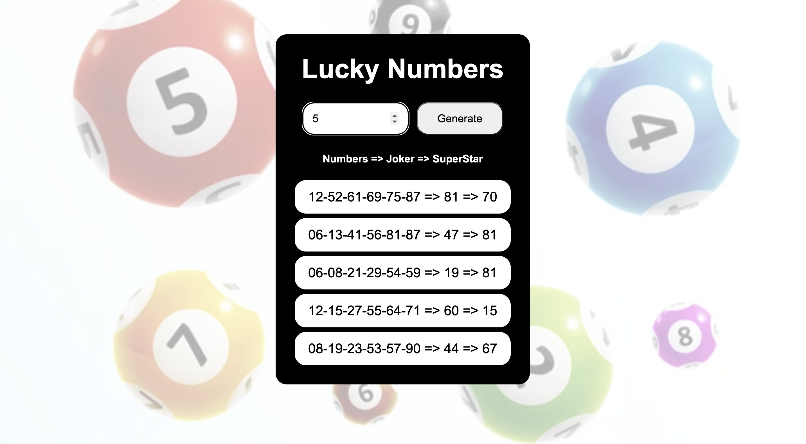

# Lucky-Numbers

## Overview

### The challenge

Users should be able to:

- View the optimal layout for the component depending on their device's screen size
- See hover states for all interactive elements on the page
- Get set(s) of numbers between 1-90
- Enter number of sets of lucky numbers.
First six numbers are lucky numbers and different from each other
Seventh number is joker and different from first six
Last one is super star number 

### Screenshot

### Links

- Live Site URL: [https://yusuf-demirci.github.io/Lucky-Numbers/](https://yusuf-demirci.github.io/Lucky-Numbers/)

### Built with

- Semantic HTML5 markup
- CSS custom properties
- Flexbox
- Mobile-first workflow
- JavaScript & JQuery
